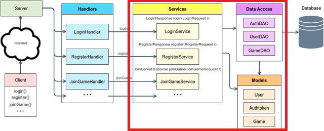

# Course links

- [Chess](https://github.com/BYUCS240TA/Chess)
  - [Example projects](https://github.com/BYUCS240TA/Chess/tree/main/example-chess-projects)
  - [Specification](https://github.com/BYUCS240TA/Chess/tree/main/specifications)

# Instruction

## IntelliJ

- Turn on format on save in Settings>Tools>Actions on Save
- `Option-Option-down/up arrow`: Select multiple lines with cursors:
- `Ctrl-G`: Select same text multiple cursors
- `CMD-B`: Goto definition

## Curl

Allocated time: 20 minutes
https://docs.google.com/presentation/d/1pM_tUVD7c6kWpHkEwuRpbWmoBFss3GuK

## Git/GitHub

Allocated time: 70 minutes

## MySQL

Allocated time: 45 minutes

## WebSocket

Allocated time: 70 minutes

# All things Java

## History

- 1991: work on Java began as James Gosling.

    

- 1996: Version 1 released.
- 2000: I started using Java with version 3.
- 2006: Sun starts (OpenJDK](http://openjdk.java.net/projects/jdk/) under a GPL license. OpenJDK become the reference implementation.
- 2010: Oracle acquires Sun and Java
- 2019 (JDK8) OracleJDK requires license for production deployment. OpenJDK gains steam.
- 2021 Oracle relents and makes it open again with option for paid support.
- 2023 Adoptium becomes the primary location to get OpenJDK

[History](https://www.marcobehler.com/guides/a-guide-to-java-versions-and-features)

## Java Goals

1. It must be simple, object-oriented, and familiar.
1. It must be robust and secure.
1. It must be architecture-neutral and portable.
1. It must execute with high performance.
1. It must be interpreted, threaded, and dynamic.

## Installations

Install the [zip file](https://adoptium.net/) and add it to your path. Adoptium is considered the best place to go.

I actually installed by installing IntelliJ and then having it install the JDK for me.

I then added the following to my `.zshrc` so that I could launch from the console.

```sh
alias idea='open -na "IntelliJ IDEA CE.app" --args '
```

## Versions

- **8**:
  - Lambdas
    ```java
    Runnable runnable = () -> System.out.println("Hello world two!");
    ```
  - Function style collections
    ```java
    List<String> list = Arrays.asList("franz", "ferdinand", "fiel", "vom", "pferd");
    ```
  - Stream chaining
    ```java
    list.stream()
    .filter(name -> name.startsWith("f"))
    .map(String::toUpperCase)
    .sorted()
    .forEach(System.out::println);
    ```
- **9**: more stream and collection functions. HTTP client
- **13**: Unicode 12.1 support, new switch syntax, multiline string with `"""` syntax
- **14**: Records
- **18**: UTF-8 is default. jwebserver HTTP server

## Configure IntelliJ

- Added `Reformat code` action on Save in the Tools settings

## Notes of things to fix.

- `Installing Java` video references Android Studio for IDE.
- `JavaDoc` references API 16. 17 was the last LTS, 20 is latest

## Building

To run from the console use:

```sh
java -classpath out/production/spell spell.Main notsobig.txt cow
```

To build a jar file from the output use:

```sh
java -classpath spell.jar spell.Main notsobig.txt cow
```

## Streams, lambdas, and optionals

Here is an example of using stream, lambda, and optional to get the root cause of an exception. This is really not that much cleaner than more explicit code, but it seems to be where the cool Java kids are going.

It is interesting that you can pass a method to the `iterate` function and it uses reflection to find that method on the object. This must be most useful the the `hasNext/next` iteration.

```java
        Optional<Throwable> rootCause = Stream.iterate(e, Throwable::getCause)
                .filter(element -> element.getCause() == null)
                .findFirst();
```

# Implementing SpellChecker

1. You have four hours to complete the exam. There are three tries with decreasing max value (100, 80, 60). Save 30 minutes to upload your artifacts.
1. Download the two zip files
1. Create a project named SpellCorrector
1. Move the source code into `src/spell`
1. Move the tests into `src/passoff`
1. Move the jar files into `jar`
1. Add the jar files to the `project structure` > `project settings` > `module` > `dependencies`
1. Create Trie, SpellCorrector, and Node classes and implement the stub of their interfaces.
1. Implement Node
   1. Add child array and value properties
   1. Implement `INode` methods
1. Implement Trie
   1. Add `root` Node
1. Add default Trie `toString`, `hashCode`, and `equals` methods.
   1. `toString` must return a new line separated list of words.
   1. `hashCode` must not use any of the automatic hashing functions.
   1. `equals` must not use hashCode or toString
1. Add `SpellCorrector` to main class
1. Run `TrieTest` and fix until they all pass
   1. Most of the code is in Trie. These are just recursive functions for manipulating INode.
   1. I started with the generated functions for `toString`, `hashCode`, and `equals` and then tweaked them to work.
   1. I did implement `equals` on Node and then just compared the root nodes of Trie.
1. Run `SpellTest` and fix until they all pass
   1. Implement the `SpellCorrector.useDictionary` method using `File` and `Scanner`.
      ```java
      public void useDictionary(String dictionaryFileName) throws IOException {
          var trie = new Trie();
          try (Scanner scanner = new Scanner(new File(dictionaryFileName))) {
              while (scanner.hasNext()) {
                  String n = scanner.next();
                  trie.add(n.toLowerCase());
              }
          }
      }
      ```
1. Just remember `File` and `Scanner` and that it users `hasNext` and `next` to iterate.
1. Make sure you lowercase the words passed to `suggestSimilarWord`.
1. All of the edit functions take a form of two substrings being combined in some way.
   ```java
     private void calculateAlteration(String inputWord, ArrayList<String> words) {
     for (var i = 0; i < inputWord.length(); i++) {
         for (var c : Trie.alphabet) {
             if (inputWord.charAt(i) != c) {
                 var p = inputWord.substring(0, i);
                 var s = inputWord.substring(i + 1);
                 words.add(String.format("%s%c%s", p, c, s));
             }
         }
     }
   }
   ```
1. Collect the matching results and return the one that has the highest value.
1. If nothing matches then run it again with the list from edit distance 1.

## Similarity definition

The following rules define how a word is determined to be most similar:

1. It has the “closest” edit distance from the input string
1. If multiple words have the same edit distance, the most similar word is the one with the closest edit distance that is found the most times in the dictionary
1. If multiple words are the same edit distance and have the same count/frequency, the most similar word is the one that is first alphabetically

## Edit distance

1. Deletion Distance: A string s has a deletion distance 1 from another string t if and only if t is equal to s with one character removed. The only strings that are a deletion distance of 1 from “bird” are “ird”, “brd”, “bid”, and “bir”. Note that if a string s has a deletion distance of 1 from another string t then |s| = |t| -1. Also, there are exactly |t| strings that are a deletion distance of 1 from t. The dictionary may contain 0 to n of the strings one deletion distance from t.
1. Transposition Distance: A string s has a transposition distance 1 from another string t if and only if t is equal to s with two adjacent characters transposed. The only strings that are a transposition Distance of 1 from “house” are “ohuse”, “huose”, “hosue” and “houes”. Note that if a string s has a transposition distance of 1 from another string t then |s| = |t|. Also, there are exactly |t| - 1 strings that are a transposition distance of 1 from t. The dictionary may contain 0 to n of the strings one transposition distance from t.
1. Alteration Distance: A string s has an alteration distance 1 from another string t if and only if t is equal to s with exactly one character in s replaced by a lowercase letter that is not equal to the original letter. The only strings that are an alternation distance of 1 from “top” are “aop”, “bop”, …, “zop”, “tap”, “tbp”, …, “tzp”, “toa”, “tob”, …, and “toz”. Note that if a string s has an alteration distance of 1 from another string t then |s| = |t|. Also, there are exactly 25\* |t| strings that are an alteration distance of 1 from t. The dictionary may contain 0 to n of the strings one alteration distance from t.
1. Insertion Distance: A string s has an insertion distance 1 from another string t if and only if t has a deletion distance of 1 from s. The only strings that are an insertion distance of 1 from “ask” are “aask”, “bask”, “cask”, … “zask”, “aask”, “absk”, “acsk”, … “azsk”, “asak”, “asbk”, “asck”, … “aszk”, “aska”, “askb”, “askc”, … “askz”. Note that if a string s has an insertion distance of 1 from another string t then |s| = |t|+1. Also, there are exactly 26\* (|t| + 1) strings that are an insertion distance of 1 from t. The dictionary may contain 0 to n of the strings one insertion distance from t.

## Results

1. I implemented this three times. Once to figure it out. A second time to see if I could do it again. This time I took careful notes (above). A third time to time myself. Each time I created a totally different solution.
1. On the third time, without using my notes, I was able to complete this in 1:45 minutes.
1. I find this very nerve racking. It forces me to go as fast as possible without thinking if the architecture is good.
1. The tests are vital. Just let them guide your efforts.
1. The basic outline is:
   1. Create an empty project and copy in the interfaces, tests, jars, and test files.
   1. Implement main, and the stubbed classes. Set up the project to reference the jars.
   1. Implement reading spell checker file and simply returning the given word.
   1. Run the trie tests
   1. Implement Trie and Node find and add ability.
   1. Implement toString
   1. Implement hashCode and equals
   1. Run Spell tests
   1. Implement a class to track the candidate words, the generated words, the best current match, and to generate candidates using insertion, deletion, alteration, and transposition.
   1. Use the class for edit distance one, with the input word as the candidate.
   1. Use the class for edit distance two, with edit distance one's generated words and the candidates.

# Chess

## Codebase

`git clone https://github.com/BYUCS240TA/Chess.git`

### Top level

1. example-chess-projects - Project solutions
1. specifications - Specifications. This is what is given to the students
1. Example Chess Projects - Old stuff, maybe we can kill this now?
1. Specs - Old stuff, maybe we can kill this now?
1. proguard-7.3.2 - Used to obfuscate the test driver code

### Project level (specifications)

The chess project is divided into 6 different projects.

1. 1-chess-game - Basic board setup and moves. When the tests all pass the student is done.
1. 2-server-design - Stubbed implementation of service endpoints. Produce the JavaDocs to pass off this deliverable. It isn't clear to me from the documentation what endpoints or code structure is required. There is an API_Calls.txt file in the root that details the endpoints. Are we going to give them that information? The diagram seems to indicate that there is a required structure to the code (Server, Handlers, Services, Data Access, Models), but I'm not sure that is enough to actually produce what you are hoping for. Honestly, I'm not sure what I am supposed to produce for this.
1. 3-web-api - Actually implement the service. Lots of detail here about what is to be built. When the tests all pass the student is done.
1. 4-database - Implement the database. When the tests all pass the student is done.
1. 5-pre-game - Implement the client. When the tests all pass the student is done.
1. 6-game-play - Implement the game using WebSocket for communication. When the tests all pass the student is done.

## Database

It looks like the backend database is expected to be mysql and it is hard coded to look for it on the same server as the code is running on.

`localhost:3306/chess`

```mysql
CREATE DATABASE IF NOT EXISTS chess;
SHOW databases;
```

We need to change the root user and password found in `Database.java`.

    private static final String DB_USERNAME = "chessadmin";
    private static final String DB_PASSWORD = "monkeypie";

### Users

```mysql
SELECT user FROM mysql.user;
CREATE USER IF NOT EXISTS chessadmin IDENTIFIED BY 'monkeypie';
GRANT CREATE, SELECT, INSERT ON chess.* TO chessadmin;
```

# Building it for myself

## 1-chess-game

I followed the instructions `GettingStarted-ChessGame.docx` in order to get the project set up.

1. Create project
1. Create `main`, `starter`, and `test` under `src` dir. Mark `main` and `stater` as "Sources root", mark `test` as "Test root".
1. Copy over `chess` and `passoffTeests` folders from the `specification` provided code.
1. Added `org.junit.jupiter:junit-jupiter:5.9.2` as a dependency from Maven.
1. Reviewed `ChessGame.docx`. This basically tells the class structure and how to setup the tests. The rules of chess are also covered.

I then created a stub for the required interfaces (board, game, move, piece, and position) in a `chess` package.

I then starting with `BishopMoveTest`. After a bunch of boilerplate code and hashCode and equals functionality I finally got the tests to pass. You must make sure you check the color of the pieces.

I continued working through the different pieces. I had to add a history of moves to `board` in order to get castle and en passant to work. Java is coming back to me. I am not quite sure the interfaces are correct. I have to cast the implementations in several cases (especially with `board`) in order to provide the operations I need. I could use static methods, but it seems like operations like `isSquareEmpty` or `isOriginalPosition` make sense for the board interface. Perhaps this should all be on `game`. That actually makes more sense, but we only pass around board. I suppose I could add static methods to `game` that do my helper calculations. Some are very specific though, such as when I calculate en passant I need to access the history of moves.

I got all the tests to pass after about 7 days (~15 hours) with 25 commits.

## 2-server-design

This module took me about 4 hours to do. The trick is defining what is "good" design. This is a very opinionated subject. It is probably worth some time talking to the class about this. What is "right", "wrong", "fad", and "fantasy".

It seems to me that 2 and 3 modules are backward. At least there has to be a high level design that isn't discussed. It should start from the user's perspective and work its way down to the database. With the user's actions defined, you can talk about objects, with objects you can talk about endpoints, and finally what you are going to store in the database.

I followed the instructions `GettingStarted-ServerDesign.docx` and copied over the single exception class file. I then reviewed `ServerDesign.docx`. This basically says make classes for the `services`, `request`, `response`, `DOA`, and `model` classes.



We use the term `service` when I think we really mean endpoint. A service usually refers to a collection of endpoints that `serve` a particular function.

It feels a bit clumsy to have a `Game` in both the `chess` and `model` packages. If the `model` package represents the persistent data objects then why is there an embedded property that contains the `Game`. Do those properties get stored in the database? If not then how to you persist the actual moves of a game?

The next step is to diagram out my service. I'm afraid I won't design it the way the example does. However, here are the pieces I will create:

- Model for user, game, auth.
- DAO for each of the model objects.
- Service class
- Endpoint class for
  - Clear - this is a weird one because it doesn't require auth
  - Register
  - Login
  - Logout
  - List games
  - Create game
  - Join game (as player or observer)
  - (not in spec) Leave game
  - (not in spec) Get board
  - (not in spec) Make move (maybe is this over websocket?)
  - (not in spec) notify of move (maybe is this over websocket?)
- Request class for each endpoint that converts JSON to parameters.
- Response class for each endpoint to converts parameters to JSON.

**https://mermaid.live/**

```yaml
classDiagram
    class Service {
        databaseClear(req, res)
        userRegister(req, res)
        userLogin(req, res)
        userLogout(req, res)
        gameList(req, res)
        gameCreate(req, res)
        gameJoin(req, res)
    }

    class Database {
        authRegister() Auth
        authLogin() Auth
        authLogout()
        userCreate() User
        userGet() User
        gameCreate() Game
        gameUpdate()
        gameList() Game[]
    }

    Service --> Database
    Service --> Request
    Service --> Response
    Database --> User
    Database --> Game
    Database --> Auth

    class User {
        name : string
        id : id
    }

    class Game {
        name : string
        id : id
        black : id
        while : id
        turn: id
        board: char[][]
        observers : id[]
    }

    class Auth {
        token : string
    }

    class Request {
        body: JSON
    }

    class Response {
        send(status:int, body:JSON)
    }
```

I created a package for `service`, `dataAccess`, and `model`. I then populated the packages with a single class for `Database`, a `Request` and `Response` class, a single `Service` class that provides all of the endpoints, and model classes for `User`, `GamePlay` (to differentiate it from the `chess.Game` class), and `Auth`.

### JavaDocs

Trying to get rid of all the warnings that the JavaDoc compiler outputs reminded me of all the reasons I don't write comments. Uncle Bob does a good just specifying why. This article echos his points:

http://asolntsev.blogspot.com/2010/05/why-devil-invented-javadoc.html

I prefer to use:

- Properly named functions
- Short functions that do one thing
- Tests
- Code navigation that you can step through to really see what it does
- Comments when the business logic is complex or not clear from the code
- Comments for public endpoints where the tests can code cannot be referenced

Here are a couple of examples of comments that could be improved (or eliminated):

```java
/**
 * Provides access to the ChessServer
 * Is obfuscated into a Jar to keep hidden from students
 */
public class TestServerFacade {}
```

The problem with this is `Why`? Why is it important to keep it hidden from students? Even with obfuscation Intellij we simply decompile it. What is it that we don't want students to have?

```java
    /**
     * Adds a chess piece to the chess board
     * @param position where to add the piece to
     * @param piece the piece to add
     */
    void addPiece(ChessPosition position, ChessPiece piece) {}
```

In this example the code is better docs than the docs. The variable names speak for themselves, but by adding JavaDocs you have just created maintenance overhead. Plus the docs are just bad. They stutter. `addPiece() Adds a piece, Piece the piece to add` - Really?

## 3-web-api

This one looks pretty big. Hook up the server, write the endpoints, store data in memory, and write tests.

I read the `WebAPI` document and there are some pretty details requirements about how to structure the code. It might be good if some of that was given in the design section. I had to go back and change my model objects based upon the requirements in this module.

There is no description of how the game will actually be played. I think we need a big picture overview in here somewhere.

- Shouldn't `clear` be a `DELETE` instead of a `POST`.
- How do you observe?
- How do you actually play the game?
- If you can login with a username, then what is the point of the userid or email? Are all three of them unique keys?
- Trying to register an existing user should return 409 (conflict), not 403 (forbidden).
- Returning `success` should instead just use HTTP status codes. Errors can have descriptive messages.

| Endpoint       | Purpose                             | Description                                                                                                                                                                                                                                                                                                                                                                               |
| -------------- | ----------------------------------- | ----------------------------------------------------------------------------------------------------------------------------------------------------------------------------------------------------------------------------------------------------------------------------------------------------------------------------------------------------------------------------------------- |
| /user/login    | Log in a user                       | A request body must be supply the username and password. If login succeeds, an authorization authToken is returned. Use the authToken on other API calls that require authorization. The returned JSON object contains "Authorization" (the authorization authToken) and "username" (the username that was just logged in). No authorization authToken is required to call this endpoint. |
| /user/register | Register a user                     | Returns the same JSON object as log in, including an authorization authToken. You may use the authToken with future requests that require authorization. No authorization authToken is required to call this endpoint.                                                                                                                                                                    |
| /user/logout   | Logs out an authenticated user      | Returns JSON result with success status, or if failed error message describing reason. An authToken is required to call this endpoint.                                                                                                                                                                                                                                                    |
| /games/list    | Lists all the games in the database | This API does not take a request body. The response JSON lists all the games, including the board. An authToken is required to call this endpoint.                                                                                                                                                                                                                                        |
| /games/create  | Create a new Chess Game             | The request body must contain a name for the game. The response JSON contains the ID of created game, a success status and, if failed, an error message describing the reason. An authToken is required to call this endpoint.                                                                                                                                                            |
| /games/join    | Join a Chess Game                   | The request body must contain the game ID, as well as what color the user wants to claim. The response JSON contains a success status and, if failed, an error message describing the reason. An authToken is required to call this endpoint.                                                                                                                                             |
| /games/watch   | Watch a game                        | The request body must contain the game ID. The response JSON contains a success status and, if failed, an error message describing the reason. An authToken is required to call this endpoint.                                                                                                                                                                                            |
| /clear         | Clear ALL data from the database    | This includes users and all game data. No authorization authToken is required.                                                                                                                                                                                                                                                                                                            |

### Web

I rewrote the web interface to be a little more modern, while still being vanilla JavaScript.

### Starter Code

Followed the directions for copying over the libs, serverTests, and web. Installed the required libs. Note that gson is included both in the libs and the requested maven dependencies.

### Writing the server

[Spark docs](https://sparkjava.com/documentation)
[Spark Tutorial](https://medium.com/@durgaswaroop/create-a-simple-rest-application-with-spark-micro-framework-84ebd66b4ce7)

Here is an example of using different times of `Route` implementations for a Spark handler.

```java
package server;

import spark.*;

import static spark.Spark.*;

public class Server {
    public static void main(String[] args) {
        port(8080);
        externalStaticFileLocation("web");

        Spark.get("/hello1", (request, response) -> "Hello1");
        get("/hello2", (request, response) -> handle(request, response));
        get("/hello3", new Cow());
    }

    static public Object handle(Request req, Response res) throws Exception {
        return "Hello2";
    }


    private static class Cow implements Route {
        public Object handle(Request req, Response res) throws Exception {
            return "Hello3";
        }
    }
}
```

Spark supports path parameters.

```java
get("/hello/:name", (request, response) -> "Hello " + request.params(":name"));
```

I created a single `Server`, `Service` and `Database` class that handles all the endpoints and database operations. I used the model classes for most endpoint request and responses, but had to create a couple specialized classes for response/requests that are non-standard.

I probably spend 6 hours on this. Pretty easy plumbing work. Spark is OK. It would be nice if it supported JSON directly and also had the concept of middleware like Express does.

## 4-database

Followed `GettingStarted-Database` and copied over the test file and the dataAccess `database` file. Changed the password to match my database.

Added `com.mysql:mysql-connector-j:8.0.33` to my libraries using Maven. The docs didn't have `com.` on the front. Mistake?

Manually stopping and restarting the server during the tests is a bit weird. Why doesn't the test just start up and restart the server?

If I don't restart the server everything works fine and so I am ready to actually plug in the database.

There is a nice document that tells you how to install MySQL.

I'm not a huge fan of the unit test requirement for the web-api and database modules. It seems like the higher level HTTP tests do a great job testing the code, and adding more tests just creates maintenance. Of course this is good practice, but wouldn't it be better to just add tests the to the existing suite?

It is interesting that the `database.java` file was provided to establish the connection. Was that considered too hard for the students to do?

Why doesn't the `database.java` file use a connection pool?

I like the new automatic resource management functionality that works on anything that implements `AutoClosable`.

```java
try (var conn = db.getConnection()) {
    try (var preparedStatement = conn.prepareStatement("UPDATE users SET name = ? WHERE id = ?")) {
        preparedStatement.setString(1, "John Doe");
        preparedStatement.setInt(2, 100);
        preparedStatement.executeUpdate();
    }
} catch (SQLException e) {
    throw new DataAccessException("Unable to configure database");
}
```

Not a huge fan of MySQL in Java. Feels really clunky. There must be some good libraries out there that make it easier.

This took me about 5 hours. Easy plumbing work.

## 5-pre-game (Client)

Followed instructions in `GettingStarted-Pregame`.

- Created client module
- Created shared module
- Setup dependencies on shared module for `myChess` (server) and `client`
- Moved shared files to Shared module
- Created client JAR. After building the JAR I can run it with: `java -jar client.jar`

Read `Pregame`. Not really enough info here to know how to get started building the REPL.

I'm a bit confused on what the instructions for testing are. Am I testing my ServerFacade? Am I supposed to write that now? The instructions seems to indicate that I wasn't suppose to implement game play yet.

I spent a lot of time remembering how reflection works in Java. Also relearned how to build an HTTP client (painful).
Playing around with console output to move things around. Surprised that they don't backspace the board for display.
Implementing tests for my eval function since there are no provided tests for this module.
Got about half of the functions working after 8 hours of work. Basically just need to display the blank board.

## 6-game-play (WebSocket)

The protocol is named `WebSocket`, not `Web Socket` or `WebSockets`.
